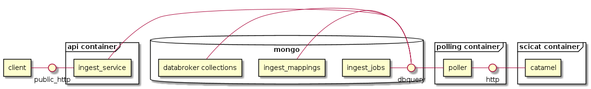

# Components
The splash ingest service is split into several containers.

- **client** Restful API client sending job requests
- **ingest_service**  A RESTFul service for creating and display status of jobs and mapping files
- **ingest_mappings** A MongoDB Collection that stores configured mapping files, a guide to ingestion
- **ingest_jobs** A MongoDB Collection that stores information about Jobs
- **poller** A python process that polls for new jobs from the **ingest_jobs** collection and performs ingestions

The **ingest service** has an OpenAPI API document available at http://[hostname]/api/ingest/docs

The repository implements functionality for accepting ingestion jobs. An ingestion job takes information about a file on the file system and a mapping document in a database. The jobs api simply creates a new job for future processing.

Once a job is created, a separate process polls the jobs collection in mongo for new jobs to process. This process picks up a job (which has information about the file to ingest and the mapping document to run) and ingests the document into mongo using the the [mongo_normalized serializer](https://github.com/bluesky/suitcase-mongo).

The repository supports two runtime processes. One is a restful API (implemented with [FastApi](https://fastapi.tiangolo.com/ ) ). This supports submitting and retreiving information about jobs.

The second is the job poller, which polls mongo for unprocessed jobs and performs the ingestion specified in the job.

For information on deployment, including how to stand up a local instance as a developer, see [deployment](./docs/deployment.md)